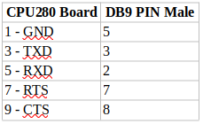
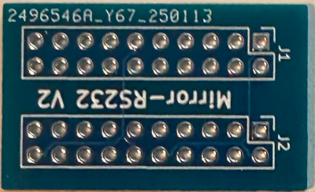
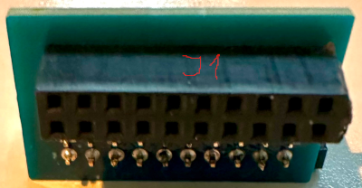
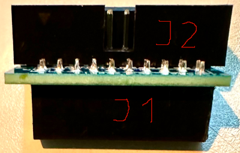
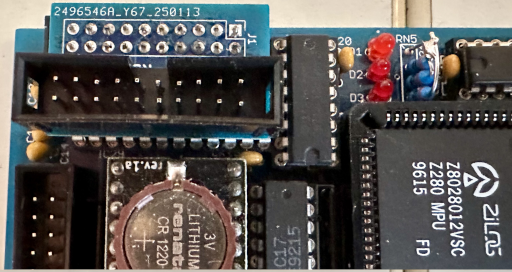
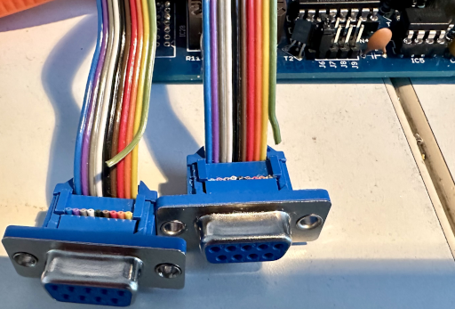
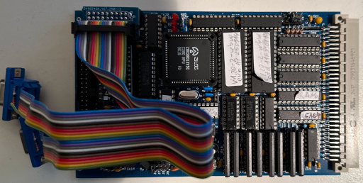

# RS232Adapter
Das CPU280-Board sollte mit einem 20-poliger Wannenstecker für die serielle Schnittstelle bestückt werden.
Unglücklicherweise ist die Pinbelegung nicht so ausgeführt das man direkt Flachbandkabel mit 9-poligen angepressten D-SUB-Buchsen verwenden kann.

Man muß ein Kabel für die serielle Verbindung löten. Die Verbindung muss wie folgt aussehen.

### Alternative Serielle Verbindung

Da solche gelöteten Kabelverbindungen immer wieder zu Problemen führen, vor allem wenn das CPU-Board im Test häufig umkonfiguriert wird, habe ich eine Alternative entwickelt bei der man mit Hilfe eines Adapters eine stabile angepresste Flachbandkabelverbindung nutzt.

Auf der eine Seite eines 20-poligen Flachbandkabels wird ein 20-poliger Pfostenstecker anpresst.
Auf der anderen Seite wird das Kabel aufgesplittet in zwei 10-polige Stänge.\
Der erste Draht eines jeden 10-poligen Strangs, von PIN 1 des 20-poligen Steckers aus gezählt, wird nicht benutzt und kann abgekniffen werden (siehe Bild).

An die verbleibenden 9 Drähte des Flachbandkabelstrangs wird eine 9-poliger D-SUB-Buchse angepresst. Das kann aber auch nach Bedarf ein 9-poliger D-SUB-Stecker sein.

Die folgenden Bilder zeigen den Aufbau.

 
Blick auf den Adapter

 
Blick von unten

 
Blick von der Seite

 
Adapter ins CPU-Board eingesteckt

 
Die angepressten D-SUB Buchsen. **Bitte den grünen, nicht benutzten Draht beachten**

 
CPU-Board mit seriellem Kabel
