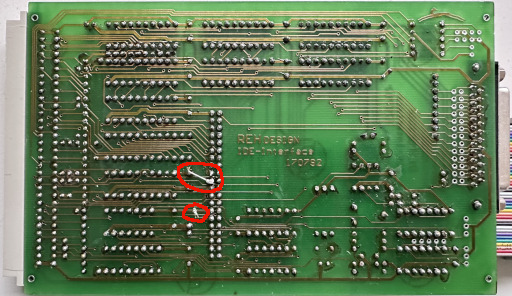
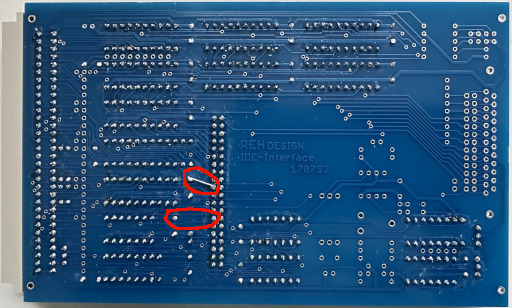
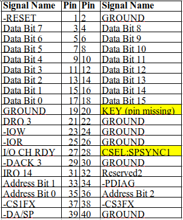
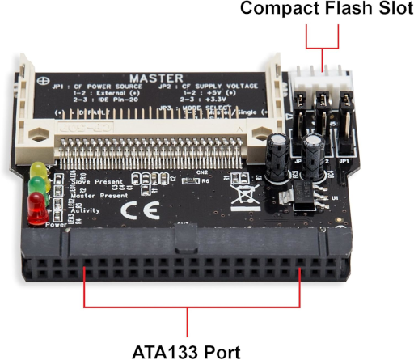
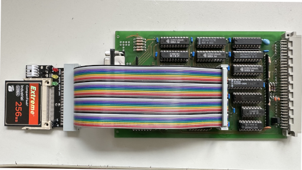
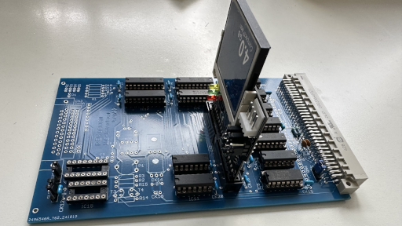

# REH-IDE

Hier findet man zusätzliche Informationen zur Nutzung des REH-IDE Boards mit Compactflash Speicherkarten statt IDE Disks.

Will man den ECB-REH-IDE Kontroller mit einer Compactflash anstelle eines IDE-Laufwerks betreiben sollte man die folgenden Punkte beachten.

Es gibt 2 Versionen des REH-IDE Boards.
Beide Boards habe auf der Bestückungsseite die Aufschrift\
\
REH DESIGN\
IDE-Interface\
   170792

### IDE Board - Version 1

Bei der original Variante ist der PIN 28 des IDE-Connectors mit +5V verbunden.
Das entspricht einem alten IDE/ATA Standard.
 

Will man dieses Board mit CF-Adapter benutzen muss die **Leiterbahn zwischen +5V und Pin 28 unterbrochen werden** (siehe Bild).
Ansonsten kommt es zu einem Kurzschluss und entweder löst sich das Board oder CF-Adapter in Rauch auf.

Es gibt eine korrigierte Version (REH-IDE-lro-20180507 siehe Gerber Files) bei der der PIN 28 offen ist, also keine 5V Verbindung hat.
Leider wurde ein Update der Beschriftung versäumt.

### IDE Board - Version 2

Bei der aktuellen IDE-Belegung ist Pin 28 mit SPSYNC/CSEL (Spindle Sync or Cable Select) belegt.
In den meisten Fällen ist der Pin nicht belegt oder mit GND verbunden.

### IDE Pin Belegung

### CF-Adapter

Bei gängigen IDE-CF Adapter (siehe Bild) ist PIN 28 mit GND Verbindung. Nutzt man einen solchen Adapter mit dem original IDE Board so führt das zu einem Kurzschluss !!!

Vor der Erstinbetriebnahme zuerst PIN 28 überprüfen.

Der IDE-CF Adapter muss mit 5V versorgt werden. Das kann zum einen über den 4-poligen Stecker per Kabel erfolgen oder über PIN 20 des CF-Adapters.

Will man sich eine zuätzlich Verdrahtung mittels externer 4-poligen Verbindung ersparen muss man PIN 20 des Wannensteckers auf der Platine mittels Drahtbrücke mit 5V verbinden.
Das geht realative einfach indem man PIN 20 mit 5V des naheliegen Kondensators CK8 verbindet (siehe Bilder).

In diesem Fall muss der Jumper J1 des abgebildeten CF-Adapters PIN2 mit PIN3 verbinden.
Bei anderen Adaptervarianten kann die Jumperbelegung anders sein und sollte überprüft werden.

Es empfieht sich ein IDE-Verlängerungskabel zur Vebindung des CF-Adapters mit den IDE Board zu verwenden.

Wenn man genügend Platz hat kann man den Adapter aber auch direkt aufstecken.

